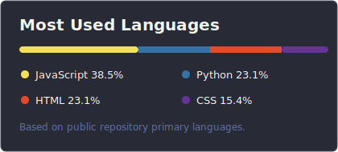

<h1 align="center">Nguyen Ho Quang Khai</h1>
<h3 align="center">I am a third-year undergraduate student majoring in Information Technology at UTH.</h3>

  
  
  
  
  
  

<h3 align="left">About me</h3>

- I am a third-year Information Technology undergraduate student at University of Transport Ho Chi Minh City (UTH).
- I am interested in ERP systems, AI engineering, and practical software engineering.
- I work with Python, Java, C#, JavaScript, TypeScript, databases, and modern web technologies.
- I enjoy building useful applications, automation tools, and AI-powered systems that solve real problems.
- I am continuously learning cloud, Linux, React, backend development, and enterprise software workflows.

<h3 align="left">Languages and Tools</h3>

  
  
  
  
  
  
  
  
  
  
  
  
  
  
  
  
  
  

<h3 align="left">GitHub Stats</h3>

<table align="center">
  <tr>
    <td align="center">
      
    </td>
    <td align="center">
      
    </td>
  </tr>
</table>
